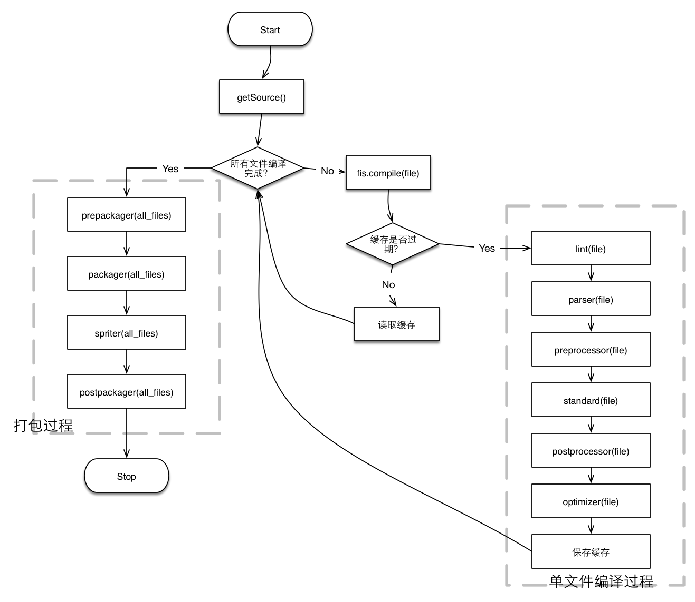

title: slide title
speaker: speaker
url: https://github.com/ksky521/nodePPT
transition: cards
files: /js/demo.js,/css/demo.css

[slide]

# FIS3技术分享
## 演讲者：beth

[slide]

# 前端工程化探索

[slide style="background-image:url('/img/bg1.png')"]

## 基于nodejs的构建工具
* grunt : 构建时间就越慢，大大拖延了开发速度,grunt有三千多个插件可供选择。
* gulp : 轻量级的，定制性会更强,gulp有近七百个插件。gulp学习成本较低，只有五个API
* webpack：打包工具
* fis: 并没有那么轻量，因此可以做的事情会比较多，所以整个项目都可以使用fis3。着重于性能优化方向，fis3现有可用插件有一千多个，基本足够我们开发使用，如果想要自己开发插件也是非常方便的。

[slide]
## FIS前端工程化构建工具
> FIS3 是面向前端的工程构建工具。性能优化、资源加载（异步、同步、按需、预加载、依赖管理、合并、内嵌）、模块化开发、自动化工具、开发规范、代码部署等问题

[slide]

#### 一个运行原理

[slide]

#### 两个命令工具
* fis3 release
    - -d [path]
    - -wl 
    - -live
    - -o
* fis3 server 
    - start
    - stop
    - open

[slide]

#### 三种语言能力
* 内容嵌入
* 定位资源
* 声明依赖

[slide]

#### 四个配置方法
* match
* media
* set
* hook

[slide]

#### 五种常用插件
* fis3-hook-commonjs
* fis-parser-babel-5.x
* fis3-postpackager-loader
* fis3-hook-node_modules
* fis3-deploy-local-deliver

[slide style="background-image:url('/img/bg1.png')"]

## 参考：
[如何用 fis3 来开发 React?](http://fex.baidu.com/blog/2016/04/develop-react-with-fis3/)
[FIS3官方文档](http://fis.baidu.com/)
[FIS3－Demo](https://github.com/fex-team/fis3-demo)
[FIS插件库](http://fis.baidu.com/fis3/docs/common-plugin.html)

